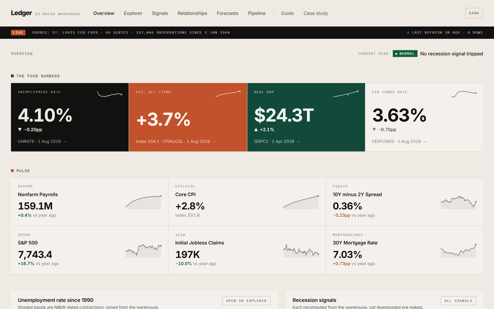
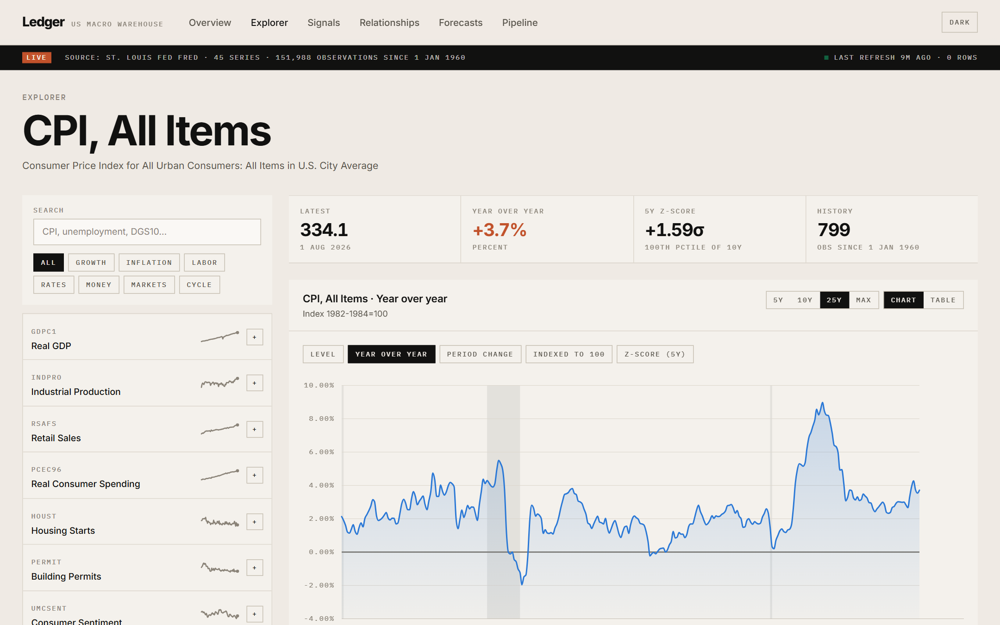
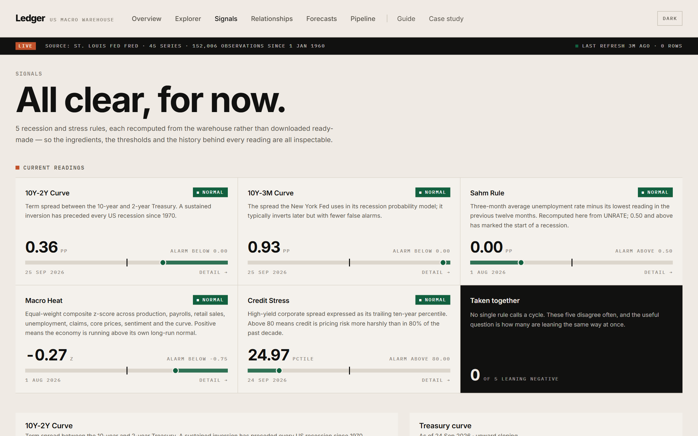
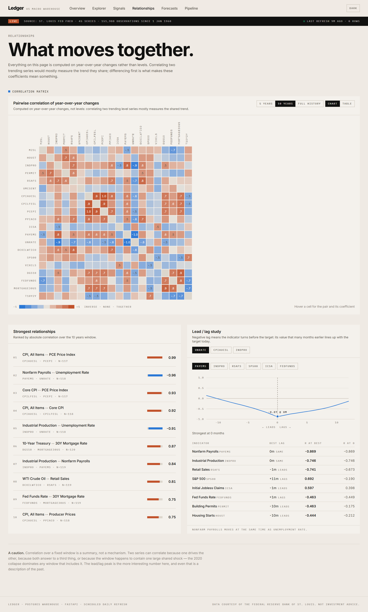
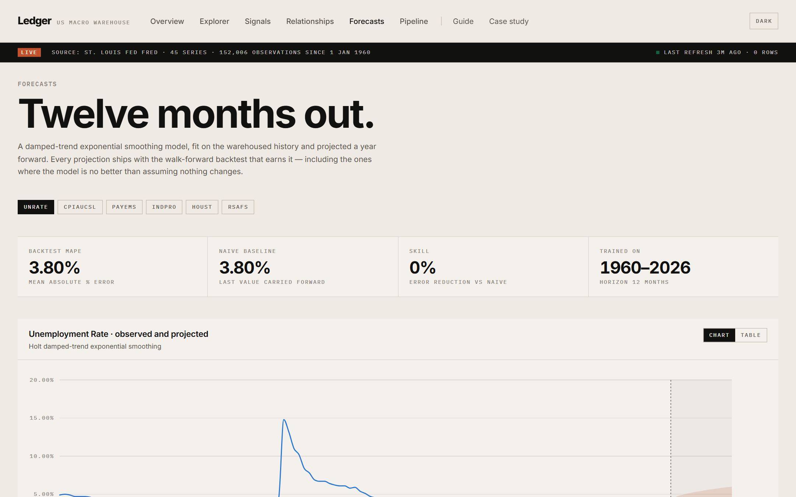
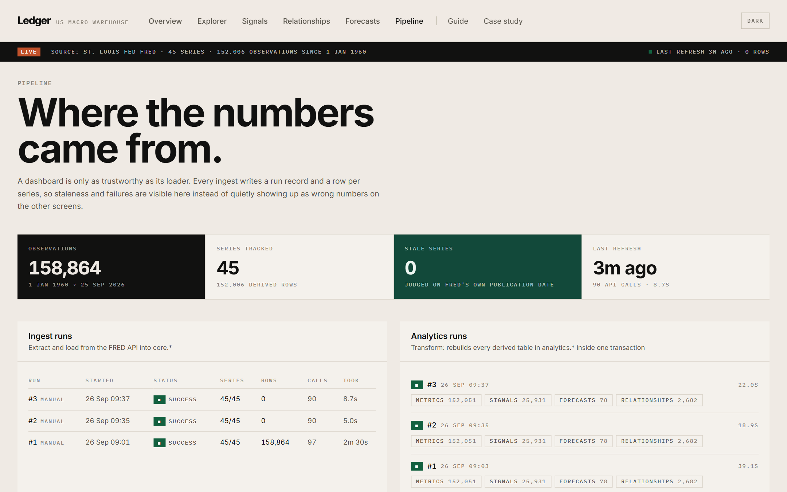

# Ledger — a US macro data warehouse

A scheduled pipeline that pulls 45 curated series from the St. Louis Fed's FRED
API into Postgres, derives a second layer of analytics on top of them, and
serves the result as an interactive dashboard.

It is built as one coherent system rather than a notebook with a chart at the
end: the loader records every run, the analytics pass rebuilds its tables inside
a single transaction, the API only ever reads, and the dashboard shows where its
numbers came from and how stale they are.



---

## What it does

**Ingest** — 45 series across growth, inflation, labour, rates, credit, markets
and cycle reference. Incremental by default with a 400-day overlap so revisions
are picked up; `--full` re-pulls everything. Rate-limited to stay inside FRED's
120 requests/minute, retried with exponential backoff, and idempotent, so a run
can be repeated or interrupted safely.

**Analyse** — for every series: year-over-year and period changes that respect
the series' own frequency, annualised rates, rolling means, trailing z-scores,
decade percentile ranks and drawdowns. Then across series:

- **Recession signals**, each recomputed from the warehouse rather than
  downloaded ready-made — the 10Y-2Y and 10Y-3M term spreads, the **Sahm rule**
  rebuilt from `UNRATE`, a credit-stress percentile, and an equal-weight
  **macro heat** composite. Inversion and trigger *episodes* are dated from the
  signal history.
- **Relationships** — a correlation matrix and a ±12-month lead/lag study, both
  computed on year-over-year changes rather than levels, because correlating two
  trending series mostly measures the trend they share.
- **Forecasts** — 12-month damped-trend exponential smoothing for six series,
  each with a walk-forward backtest against a random-walk baseline. Where the
  model fails to beat the baseline the dashboard says so.

**Serve** — a FastAPI read layer over the derived tables, and a React dashboard
with six data screens — Overview, Explorer, Signals, Relationships, Forecasts and
Pipeline — plus a visitor Guide and an on-site Case study.

## Architecture

```
FRED API
   │  httpx · token-bucket limiter · tenacity retries
   ▼
core.*          series · observations · ingest_runs · ingest_series_log
   │  pandas / numpy / statsmodels — one full rebuild per run, one transaction
   ▼
analytics.*     series_metrics · series_snapshot · signals · episodes
                correlations · lead_lag · forecasts · runs
   │  FastAPI — pure reads, no computation on the request path
   ▼
React + Vite    TanStack Query · custom d3-scale SVG charts
```

Two design decisions carry most of the weight:

1. **The analytics pass writes tables, not views.** Every number the dashboard
   shows was computed ahead of time, so a page load is a `select`. That is what
   keeps 152,000 derived rows feeling instant.
2. **The raw layer is never mutated by the analytics layer.** `core.*` is a
   faithful mirror of FRED; everything opinionated lives in `analytics.*` and is
   rebuilt from scratch each run. A bug in a transform can never corrupt the
   source data.

## Stack

| Layer | Choice | Why |
|---|---|---|
| Ingestion | Python 3.13, httpx, tenacity | Threaded pool under one shared rate limiter |
| Storage | PostgreSQL 15+ | `COPY` for bulk metric loads, JSONB for sparklines |
| Access | psycopg 3 + connection pool | Raw SQL — the queries are part of the work, not something to hide behind an ORM |
| Analytics | pandas, numpy, statsmodels | Frequency-aware transforms, ETS forecasting |
| Scheduling | APScheduler | Weekday cron with misfire grace, so a sleeping laptop still catches up |
| API | FastAPI + uvicorn, orjson | Typed, self-documenting at `/docs` |
| Frontend | React 19, TypeScript, Vite, Tailwind v4 | — |
| Charts | Custom SVG on d3-scale/d3-shape | Full control over the design system; no library fingerprint |
| Data fetching | TanStack Query | Caching matched to a once-a-day refresh |

## Running it

### With Docker — the whole system, one command

```bash
cp .env.example .env     # set FRED_API_KEY and POSTGRES_PASSWORD
docker compose up --build
```

The schema is created and the first load runs automatically; the dashboard comes
up on **http://localhost:8080** with the API proxied behind the same origin.
Five services: Postgres, a one-shot `init` that applies the schema and does the
first load, the API, the scheduler, and nginx serving the built frontend.
*(The Compose file validates but has not been run end to end — the local path
below is the exercised one.)*

### Locally

**Prerequisites:** Python 3.11+, Node 18+, a running PostgreSQL, and a free
[FRED API key](https://fredaccount.stlouisfed.org/apikeys).

```bash
cp .env.example .env          # then fill in FRED_API_KEY and DATABASE_URL

python -m venv .venv
.venv/Scripts/python -m pip install -r backend/requirements.txt   # Windows
# source .venv/bin/activate && pip install -r backend/requirements.txt

cd backend
python -m app.cli init        # create the database and apply the schema
python -m app.cli refresh     # ingest from FRED, then build analytics
python -m app.cli serve       # API on http://127.0.0.1:8000
```

```bash
cd frontend
npm install
npm run dev                   # dashboard on http://localhost:5173
```

A cold start pulls ~140,000 observations in about 35 seconds and builds the
analytics layer in about 25.

### CLI

| Command | What it does |
|---|---|
| `python -m app.cli init` | Create the database if absent and apply the schema |
| `python -m app.cli ingest [--full] [--only IDS]` | Extract and load from FRED |
| `python -m app.cli analyze [--skip-forecasts]` | Rebuild every derived table |
| `python -m app.cli refresh [--full]` | Ingest, then analyse |
| `python -m app.cli status` | Coverage and freshness per category |
| `python -m app.cli serve [--reload]` | Run the read API |
| `python -m app.cli schedule [--run-now]` | Start the daily scheduler |

### Scheduling

`python -m app.cli schedule` runs the refresh every weekday morning (07:30 US
Eastern by default, configurable in `.env`). `max_instances=1` prevents
overlapping runs and a six-hour misfire grace means a machine that was asleep
still refreshes when it wakes. For a server deployment, the same job runs fine
under cron or systemd calling `app.cli refresh`.

## Tests

```bash
cd backend && python -m pytest        # 84 tests
```

They cover the places where a silent error would put a wrong number on screen
rather than raise: frequency-aware year-over-year lags, the "." missing-value
convention, percentage-point versus percent handling for rate series, the
lead/lag sign convention, episode dating, the magnitude declared for every
series, and the backtest's willingness to report that a model has no skill.

`tests/test_security.py` pins the fixes from the pre-publication audit — that no
FRED error path can echo the API key, and that the one write endpoint stays shut.

## Security

The API is read-only, holds no user data, and is published with `pip-audit` and
`npm audit` both clean. The single write endpoint is disabled unless an
`ADMIN_TOKEN` is set, so a public deployment exposes no write surface at all.

An audit before first publication found and fixed two real vulnerabilities:

- **API key disclosure.** The key travels in the query string, and httpx embeds
  the full request URL in the exception from `raise_for_status()`. That text was
  persisted to the ingest log and served by a public endpoint — and FRED answers
  a revoked key with 403, so the likeliest failure was the one that would publish
  the credential. Every error path now runs through a redaction helper, applied
  again before the message is stored.
- **Unauthenticated refresh.** `POST /api/pipeline/refresh` rebuilt everything
  with no auth, letting anyone drain a 120/minute API budget and spawn concurrent
  in-memory rebuilds. It now returns 404 unless `ADMIN_TOKEN` is set, requires a
  constant-time token check when enabled, and refuses overlapping (409) or rapid
  (429) runs.

Both are pinned by regression tests in `backend/tests/test_security.py`. Known
limitations kept deliberately: no application-level rate limiting on read
endpoints, and no TLS in the Compose stack — both belong at the proxy.

## Notes on the analysis

A few decisions worth stating plainly, since they are the difference between a
dashboard that looks right and one that is right:

- **Percentage points, not percent.** Unemployment moving 4.0 → 4.4 is `+0.4pp`.
  Reporting `+10%` is technically true of the ratio and useless to a reader, so
  rate-type series carry an absolute change and the UI picks the right one per
  unit.
- **Magnitudes are carried explicitly.** FRED reports GDP in billions and
  payrolls in thousands. Each series has a `scale` so `24269.6` renders as
  `$24.3T`, not `$24.3K`.
- **Correlations run on changes, not levels.** Two trending series correlate at
  0.99 because both trend; the number means nothing. Everything on the
  Relationships screen is computed on year-over-year changes.
- **Freshness is measured against publication, not reference period.** A monthly
  series reporting July data in late September is current — it just has a
  publication lag. The Pipeline screen judges staleness on FRED's own
  `last_updated`.
- **Forecast skill is reported even when it is bad.** `UNRATE` scores ~0 skill
  against a random walk, and the dashboard says so rather than hiding the
  comparison.

## Design

The interface follows a Swiss editorial style: warm paper ground, flat
full-bleed tiles, hairline rules, one very large display size against small
letterspaced labels, and a few inverted accent tiles. The accent on a tile is
earned — the series sitting furthest from its own five-year norm in the wrong
direction takes the terracotta tile.

The chart palette was validated for colour-vision deficiency and contrast against
the real surfaces in both themes rather than chosen by eye. One result shaped the
product: only the first three slots stay separable when any pair can appear
together, so **series comparison is capped at three**. Two light-mode slots fall
below 3:1 against the paper ground, so every multi-series chart ships a legend
*and* direct end-of-line labels, and every chart has a table view — identity
never rests on colour alone.

Every chart carries a crosshair tooltip, a legend and direct labels once there
is more than one series, and a table view behind the `Table` toggle, so no
reading depends on colour alone.

## Screens

| | |
|---|---|
| **Explorer** — every series, five transforms, up to three compared on one axis, recession shading, table view.<br> | **Signals** — the five recession rules with meters showing distance from threshold, plus dated episodes.<br> |
| **Relationships** — correlation matrix and the ±12-month lead/lag study.<br> | **Forecasts** — projection, 80% interval, and the backtest that earns it.<br> |

**Pipeline** — ingest and analytics run history, per-series freshness, and API budget spent.



## Project layout

```
backend/
  app/
    config.py          typed settings from .env
    db.py              pooled psycopg access
    fred_client.py     rate-limited, retrying API client
    series_catalog.py  the curated 45-series panel
    ingest.py          extract + load, with run logging
    analytics/
      transforms.py    per-series derived metrics
      signals.py       curve, Sahm rule, credit stress, macro heat
      relationships.py correlations and the lead/lag study
      forecast.py      ETS forecasting and walk-forward backtest
      runner.py        stage orchestration, one transaction
    api/               FastAPI routers
    sql/schema.sql     idempotent DDL
    cli.py             operator entry point
    scheduler.py       APScheduler daily job
  tests/
frontend/
  src/
    components/charts/ the chart kit built on d3-scale
    pages/             the six screens
    lib/               API client, types, formatting
```

## Reading it

The running site carries its own documentation. **Guide** explains how to read
every chart and what the vocabulary means, for visitors with no economics
background. **Case study** tells the engineering story — architecture, the
decisions and their trade-offs, and the bugs worth admitting to — with its
headline figures read live from the warehouse rather than typed in.

## Data

All data comes from [FRED](https://fred.stlouisfed.org/), maintained by the
Federal Reserve Bank of St. Louis, and is subject to their terms of use. This
project is a portfolio piece, not investment advice.
